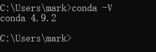
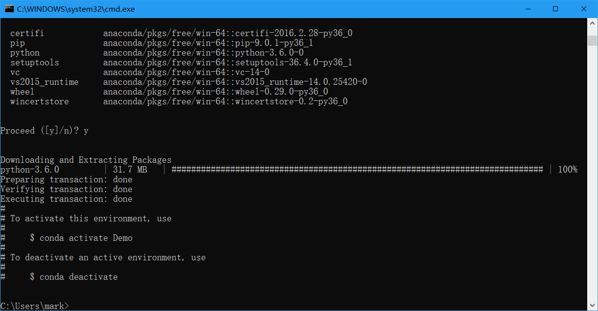
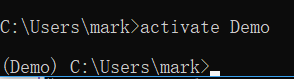
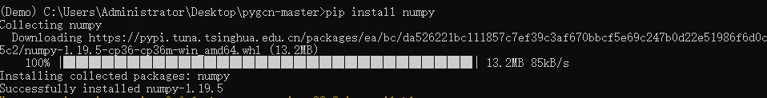

# 神经网络相关文档  
2022/10  
## 一、配置  
### 1. anaconda  
首先下载[anaconda](https://www.anaconda.com/products/distribution)。因为不同的项目需要不同的环境，所以我们需要使用anaconda管理python环境。具体安装过程可以参考[教程](https://blog.csdn.net/qq_45344586/article/details/124028689)。  
安装完毕后使用`win+R`快捷键并输入`cmd`打开命令行，在命令行中输入`conda -V`查看当前anaconda版本号，如果安装成功则出现如下：  
  
如果出现" `conda`不是内部或外部命令，也不是可运行的程序或批处理文件。 "则表示环境变量未配置，需要手动配置环境变量或重新安装程序。手动配置环境变量可以参考[教程](https://blog.csdn.net/m0_68744965/article/details/125700817)。  
### 2. PyCharm  
使用PyCharm作为编译器。打开[链接](https://www.jetbrains.com/zh-cn/pycharm/download/#section=windows)下载Community版本，如下图红框(若已申请学校邮箱可以免费使用Professional版本)，具体安装过程可以参考[链接](https://blog.csdn.net/qq_46628826/article/details/124361686)。  
pycharm默认为英文界面，若需要更改为中文可以参考[链接](https://zhuanlan.zhihu.com/p/356882955)（使用第一个方法即可）  
  
### 3.设置镜像源  
#### 配置conda镜像源  
使用`win+R`快捷键并输入`cmd`打开命令行，在命令行中输入以下代码配置conda源，可以参考[链接](https://www.cnblogs.com/genmeng/p/16566955.html)  
```cmd
conda config --add channels https://mirrors.tuna.tsinghua.edu.cn/anaconda/pkgs/free/win-64/
conda config --add channels https://mirrors.tuna.tsinghua.edu.cn/anaconda/pkgs/main/win-64/
conda config --add channels https://mirrors.tuna.tsinghua.edu.cn/anaconda/cloud/pytorch/
conda config --set show_channel_urls yes
```  
#### 配置pip镜像源  
在当前对用户目录下（C:\Users\xx\pip，xx 表示当前使用对用户，比如张三）创建一个 pip.ini，如下图。

图中我的用户名为mark（默认用户名为Administrator），pip文件夹需要自行创建。之后打开pip文件夹,新建pip.ini文件，并通过记事本或其他软件打开，并输入以下内容。其他可以参考[链接](https://www.runoob.com/w3cnote/pip-cn-mirror.html)
```cmd
[global]
index-url = https://pypi.tuna.tsinghua.edu.cn/simple
[install]
trusted-host=pypi.tuna.tsinghua.edu.cn
```
最后保存即可。
### 4. 配置环境
因为不同的项目所需的环境不尽相同，所以我们需要对每个项目建立都一个虚拟环境。此处以[Semi-Supervised Classification with Graph Convolutional Networks](https://arxiv.org/abs/1609.02907)论文为例。
#### 创建环境
首先下载程序[pygcn](https://github.com/tkipf/pygcn)并解压。
使用`win+R`快捷键并输入`cmd`打开命令行，输入以下代码创建虚拟环境：
```
conda create -n （环境名称） python==(python版本号)
如：conda create -n Demo python==3.6
```
出现下图输入y确定：

安装完成如下图：

#### pycharm选择环境
创建环境后需要到pycharm中选择所使用的环境，首先在pycharm中打开项目，之后按照[视频](mp4/video_1.mp4)操作即可
#### 安装项目所需库文件
在控制台中输入`activate 环境名`以激活环境，激活成功后命令行首端会显示环境名，如下图：

##### requirements.txt
部分项目中会包含requirements.txt文件，文件中会包含此项目所需的库文件，例如：

```
matplotlib>=2.2
numpy>=1.15.0, <1.21.0
pandas
pytest==4.0.1
```
在命令行中使用`cd`指令将当前路径切换至项目requirements.txt文件所在路径，之后使用`pip install -r requirements.txt`安装所需库文件即可。
> 切换路径时，如果需要切换盘符需要先输入“`盘符:`”，如“`D:`”。之后再使用`cd`指令
##### 没有requirements.txt文件
按照项目需求使用`pip install 库文件名==版本号`或`conda install 库文件名==版本号`安装所需库文件，版本号可省略，省略时安装最新版本。如：
```
pip install numpy
pip install numpy==1.15
```
安装成功如下图：

* 同一个项目，pip和conda安装指令最好不要混用。
* 安装失败时，查找报错信息并利用搜索引擎解决。
* 卸载使用`pip uninstall 库文件名`并输入y确定

## 二、部分程序解读
* 神经网络代码大部分为python，需要了解基础语法，对python不了解的可以观看[python教程](https://www.liaoxuefeng.com/wiki/1016959663602400)先学习一些基础知识。
* 神经网络的基础知识可以观看[《机器学习——周志华》](pdf/周志华-机器学习.pdf)这本书的第五章进行了解。
* python是面向对象的语言，有许多类方面的知识（例如继承、虚函数等）需要自行了解。
### 1. layers.py文件
``` python
class GraphConvolution(Module):
    """
    Simple GCN layer, similar to https://arxiv.org/abs/1609.02907
    """
    # 构造函数
    def __init__(self, in_features, out_features, bias=True):
        #super调用父类构造函数
        super(GraphConvolution, self).__init__()
        self.in_features = in_features
        self.out_features = out_features
        self.weight = Parameter(torch.FloatTensor(in_features, out_features))
        if bias:
            self.bias = Parameter(torch.FloatTensor(out_features))
        else:
            self.register_parameter('bias', None)
        self.reset_parameters()

    # 用于初始化权重矩阵和偏置
    def reset_parameters(self):
        stdv = 1. / math.sqrt(self.weight.size(1))
        self.weight.data.uniform_(-stdv, stdv)
        if self.bias is not None:
            self.bias.data.uniform_(-stdv, stdv)

    # 实现了卷积层的前向传播公式y=AxW+b
    def forward(self, input, adj):
        # torch.mm矩阵乘法
        support = torch.mm(input, self.weight)
        # torch.spmm稀疏矩阵乘法，因为邻接矩阵大多为稀疏矩阵
        output = torch.spmm(adj, support)
        if self.bias is not None:
            return output + self.bias
        else:
            return output

    # 用于调试程序，通过该函数来获取字符串表示形式
    def __repr__(self):
        return self.__class__.__name__ + ' (' \
               + str(self.in_features) + ' -> ' \
               + str(self.out_features) + ')'

```
layers.py中声明了图卷积层，其中forward定义了卷积层的前向传播公式$Y=AxW+b$，当想对卷积层的操作进行修改时可以修改这个方法。假设，现在需要将前向传播公式修改为$Y=Ax^2W+b$（并无实际意义，仅演示），那么这部分代码可修改为：
```python
def forward(self, input, adj):
    # 在这里对x进行平方计算
    input = input ** 2
    support = torch.mm(input, self.weight)
    output = torch.spmm(adj, support)
    if self.bias is not None:
        return output + self.bias
    else:
        return output
```

### 2. models.py文件
models.py声明了神经网络模型。在这个神经网络模型中定义了两次图卷积层，并使用了relu和log_softmax作为激活函数，在两次卷积层之间通过dropout防止过拟合。
```python
class GCN(nn.Module):
    # 构造函数
    def __init__(self, nfeat, nhid, nclass, dropout):
        # 调用父类的构造函数
        super(GCN, self).__init__()
        # 这里在模型中构建了两层图卷积层
        # 第一层的输入特征数为nfeat，输出特征数为nhid
        self.gc1 = GraphConvolution(nfeat, nhid)
        # 第二层的输入特征数为nhid，输出特征数为nclass
        self.gc2 = GraphConvolution(nhid, nclass)
        # 这里存储了一个dropout
        self.dropout = dropout

    # 前向传播
    def forward(self, x, adj):
        # self.gc1(x, adj)实际上调用了GraphConvolution类的forward，这个属性是从他们的父类nn.Module中继承来的
        # F.relu为激活函数
        x = F.relu(self.gc1(x, adj))
        # dropout防止过拟合
        x = F.dropout(x, self.dropout, training=self.training)
        # 第二层卷积层的运算
        x = self.gc2(x, adj)
        # 经过log_softmax激活函数后将值返回
        return F.log_softmax(x, dim=1)
```
模型是我们经常需要改动的部分，里面的任意部分都可以进行修改。比如,将该模型修改为一层图卷积层，一层全连接层：
> 全连接层的前向传播公式为: $y=Wx+b$
```python
class new_GCN(nn.Module):
    # 形参在满足python语法的情况下也可以随意修改
    def __init__(self, nfeat, nhid, nclass):
        # 注意这里要将GCN修改为新的类名
        super(new_GCN, self).__init__()
        # 成员名也可以修改
        # 构建第一层图卷积层
        self.gc = GraphConvolution(nfeat, nhid)
        # 第二层的输入特征数为nhid，输出特征数为nclass
        self.linear = nn.Linear(nhid, nclass)
        # 这里我们不需要dropout

    # 前向传播
    def forward(self, x, adj):
        # 将激活函数修改为sigmoid
        x = F.sigmoid(self.gc(x, adj))
        # 第二层全连接层的运算，全连接层的计算只需要一个参数
        x = self.linear(x)
        # 最后不通过任何激活函数直接返回
        return x
```
### 3. train.py文件
定义模型及优化器：
```python
# Model and optimizer
# 定义模型，输入模型所需要的参数，一般而言这里能改动的参数只有隐藏层（即nhid）和dropout
model = GCN(nfeat=features.shape[1],
            nhid=args.hidden,
            nclass=labels.max().item() + 1,
            dropout=args.dropout)
# 定义优化器
# 优化器负责优化模型中的参数，使其与训练数据及测试数据拟合
# 这里第一个参数是固定的，需要将模型的参数传输进去
# 第二个参数lr，即学习率
# 第三个参数weight decay的作用是调节模型复杂度对损失函数的影响，若weight decay很大，则复杂的模型损失函数的值也就大。
optimizer = optim.Adam(model.parameters(),
                       lr=args.lr, weight_decay=args.weight_decay)
```
> 优化器不仅只有Adam，还有SGD等。优化器的参数也很多，这些参数都可以进行调节。

开始训练：
```python
def train(epoch):
    # 记录开始时间
    t = time.time()
    # 使用训练模式
    model.train()
    # 梯度置零
    optimizer.zero_grad()
    # 模型前向传播，这个用法等同于model.forward(features, adj)
    output = model(features, adj)
    # 计算损失值
    loss_train = F.nll_loss(output[idx_train], labels[idx_train])
    # 计算分类正确率。这一步仅用于调试模型时的参考，对整个训练流程没有影响
    acc_train = accuracy(output[idx_train], labels[idx_train])
    # 反向传播，计算梯度
    loss_train.backward()
    # 优化器更新权重，至此完成一次训练
    # 只有执行了这一步，神经网络中的权重才会被更新，也就是被训练
    optimizer.step()

    # 验证模式，仅用于调试模型时的参考，对整个训练流程没有影响
    # 值得注意的是这里使用的是验证集
    # 验证集与测试集的区别在于，验证集可以作为调整模型参数的参考使用，而我们不能在测试集上调整模型参数
    if not args.fastmode:
        # Evaluate validation set performance separately,
        # deactivates dropout during validation run.
        # 打开验证模式
        model.eval()
        # 得到验证集输出
        output = model(features, adj)

    # 计算验证集损失值和正确率
    loss_val = F.nll_loss(output[idx_val], labels[idx_val])
    acc_val = accuracy(output[idx_val], labels[idx_val])
    # 输出日志
    print('Epoch: {:04d}'.format(epoch+1),
          'loss_train: {:.4f}'.format(loss_train.item()),
          'acc_train: {:.4f}'.format(acc_train.item()),
          'loss_val: {:.4f}'.format(loss_val.item()),
          'acc_val: {:.4f}'.format(acc_val.item()),
          'time: {:.4f}s'.format(time.time() - t))

# 训练的终止条件可以是循环的次数、设置损失值收敛到某个范围等
for epoch in range(args.epochs):
    train(epoch)
```
测试部分:
```python
def test():
    # 打开验证模式
    model.eval()
    # 得到测试集输出
    output = model(features, adj)
    loss_test = F.nll_loss(output[idx_test], labels[idx_test])
    acc_test = accuracy(output[idx_test], labels[idx_test])
    print("Test set results:",
          "loss= {:.4f}".format(loss_test.item()),
          "accuracy= {:.4f}".format(acc_test.item()))
```
可以发现测试、验证和训练的最大区别在于是否更新了神经网络的权值。  
在这个部分，我们可以修改的地方一般是训练的终止条件、模型的损失函数等。比如我们可以使用早停法来提前终止训练，这些方法都是为了得到最好的模型，使其能够更换的拟合数据。
### 4. utils.py
> 这个文件主要用于读取数据，但因为读取数据并没有泛用性，所以本节重点不在于读取数据。 
 
normalize函数用于计算归一化邻接矩阵，即$\hat D^{-\frac 12}\hat A\hat D^{-\frac 12}$，其中$\hat A=A+I_N$。但是在torch版本的代码中，邻接矩阵的归一化是通过$\hat D^{-1}\hat A$计算得到的，实际运用时可以根据需要更改。
```python
def normalize(mx):
    """Row-normalize sparse matrix"""
    # 计算邻接矩阵行和
    rowsum = np.array(mx.sum(1))
    # 邻接矩阵行和求逆(即-1次方)
    r_inv = np.power(rowsum, -1).flatten()
    # 将无穷大填充为0
    r_inv[np.isinf(r_inv)] = 0.
    # 将这个向量更改为对角矩阵，得到D^-1
    r_mat_inv = sp.diags(r_inv)
    # 矩阵乘法
    mx = r_mat_inv.dot(mx)
    return mx
```
计算**分类**正确率，值得注意的是labels需要为one-hot型
```python
def accuracy(output, labels):
    preds = output.max(1)[1].type_as(labels)
    correct = preds.eq(labels).double()
    correct = correct.sum()
    return correct / len(labels)
```
> 在神经网络的运算过程中，所有参与运算的变量必须为`Tensor`类，这也就是为什么在读取数据时需要将其转换为`FloatTensor`等